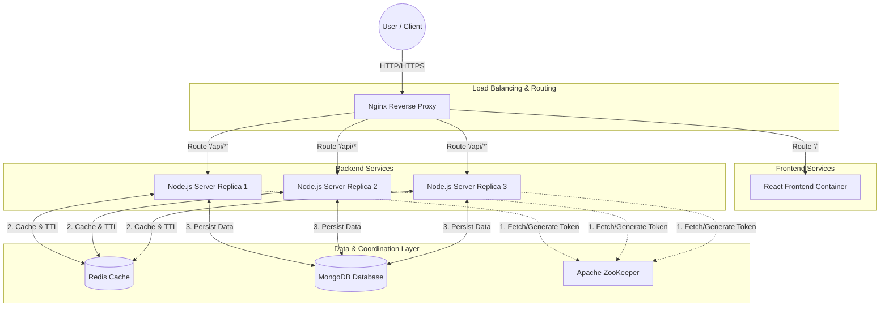
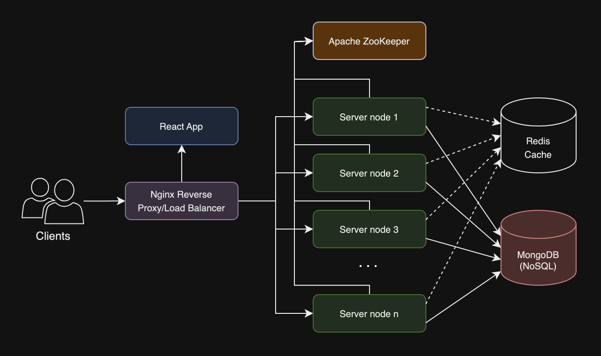

# Scalable URL Shortener

An enterprise-grade, highly scalable URL shortener designed to handle high-throughput traffic and ensure low latency. Built with a distributed architecture in mind, the system employs modern caching strategies, decentralized token generation, and robust data persistence.

## Architecture Diagram



## System Components

- **Frontend**: A React application (powered by Vite) providing a responsive and intuitive user interface. 
- **API Gateway / Proxy (Nginx)**: Acts as the primary entry point. It dynamically balances traffic across the available backend instances and routes static asset requests to the frontend container.
- **Application Servers (Node.js)**: Stateless backend nodes handling the core business logic. They are designed to scale horizontally. 
- **ZooKeeper Cluster**: Manages distributed token generation. By coordinating across instances (e.g., assigning ID ranges), ZooKeeper guarantees that no two generated short URLs will collide across the decentralized servers.
- **Redis Cache**: Used extensively to minimize database hits. It acts as an in-memory look-aside cache to quickly resolve active URLs and effectively manages short URL expiration (TTL management).
- **MongoDB**: The primary source of truth, persisting the mapping between long URLs and short tokens.

## System Flow (Senior Dev Breakdown)

### 1. URL Shortening (Write Path)
When a user requests to shorten a long URL, the request hits **Nginx**, which forwards it to one of the **Node.js** replicas. The replica leverages **ZooKeeper** to generate a unique token (collision resistance is key in distributed environments). The system then writes the long-to-short mapping to **MongoDB** and aggressively caches the result in **Redis**.

### 2. URL Redirection (Read Path)
When a user clicks a short URL, the request is proxied to the backend. The backend first checks **Redis**. Since reads drastically outnumber writes in a URL shortener, hitting an in-memory cache guarantees sub-millisecond lookups. If there's a cache miss, the system queries **MongoDB**, updates Redis for subsequent requests, and then returns a `301/302 Redirect` to the user.

## Running Locally

This project is fully containerized. To spin up the entire distributed system locally:

1. Copy the environment variables template:
   ```bash
   cp .env.example .env
   ```
2. Start the cluster:
   ```bash
   docker-compose up --build -d
   ```
3. Access the application:
   - **Frontend UI**: `http://localhost:80`
   - **API Base**: `http://localhost:80/api`

## Legacy Architecture Diagram

